## E-mail: felipekian@yahoo.com.br

# PROJETO SALÃO DE BELEZA

 

## OBJETIVOS

Colocar em **prática os conceitos de POO** ( Programação Orientada à Objetos ) em projeto prático como **Herança, Polimorfismo, Encapsulamento**.

## RECURSOS UTILIZADOS

* **LINGUAGEM JAVA**
* **BANCO DE DADOS MySQL OU MariaDB**

## COMO UTILIZAR ?

* Baixe a pasta **'Sistema - Executável' que conterá o executável do sistema** ( precisa ter o JAVA instalado ).

* Na pasta **'Banco de Dados - SQL - MySQL'** encontra-se o arquivo SQL chamado **'salaoSistema.sql'**. Crie um banco de dados chamado **'salao'** e importe o arquivo para criação das tabelas e relacionamentos. 

# IMAGENS DO SISTEMA

Tela de **Login** do sistema
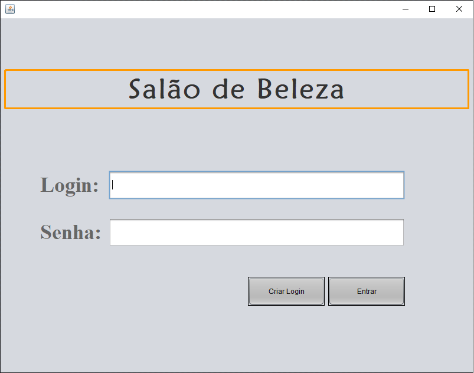

 

Tela de **Cadastro de login** do sistema
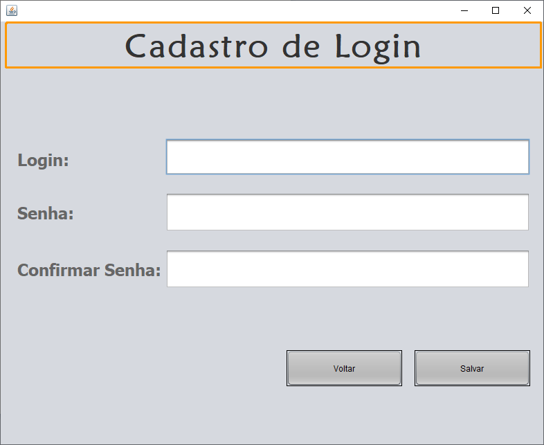

 

Tela **HOME** que direciona o usuário para as ações implementadas no sistema
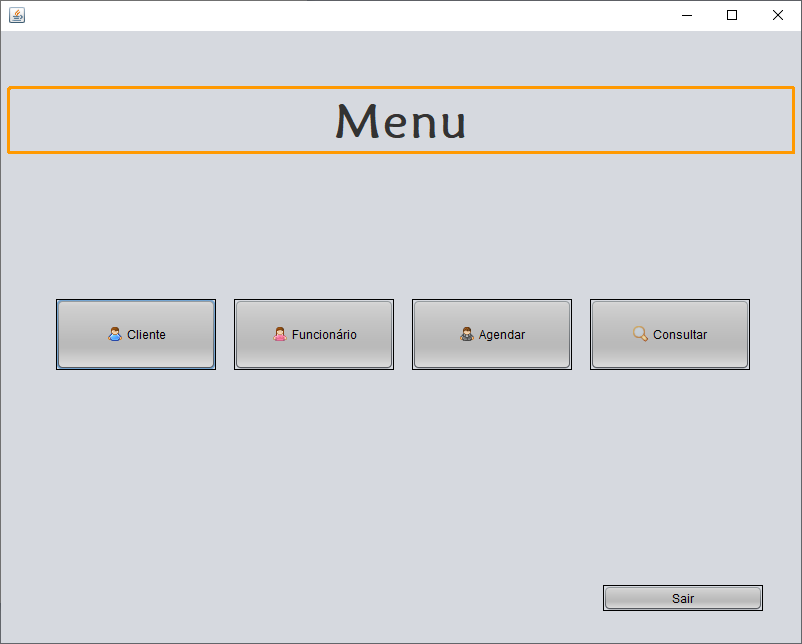

 

Tela **Ações que pode-se fazer com o clientes** 'CRUD' -> Criar, Recuperar, Deletar e Atualizar
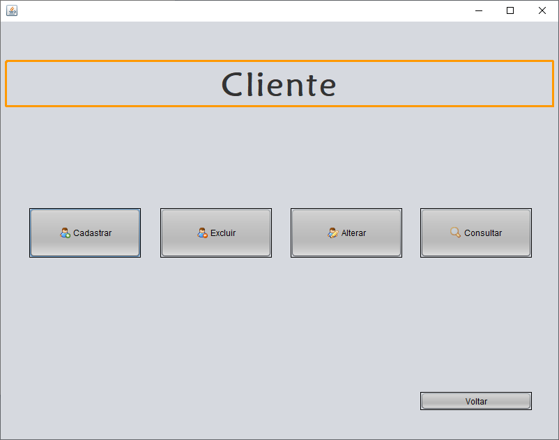

 

Tela de **Cadastro** de clientes
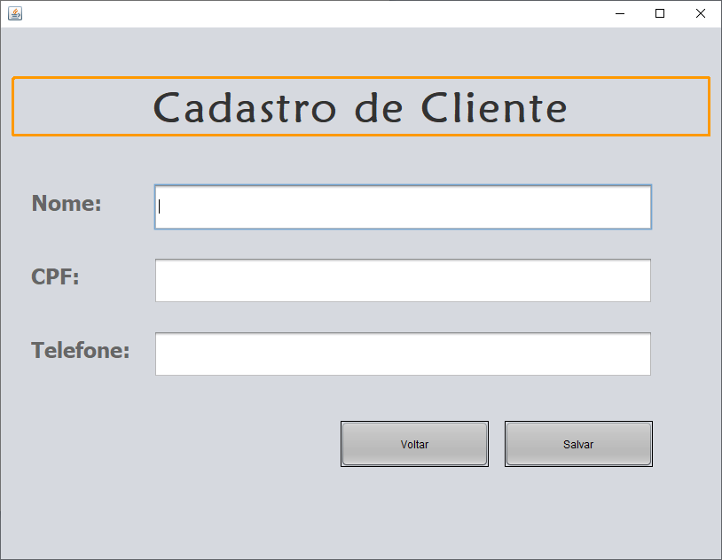

 

Tela de **Remoção** de clientes
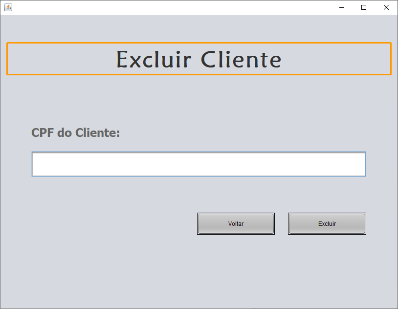

 

Tela de **Listagem** de clientes
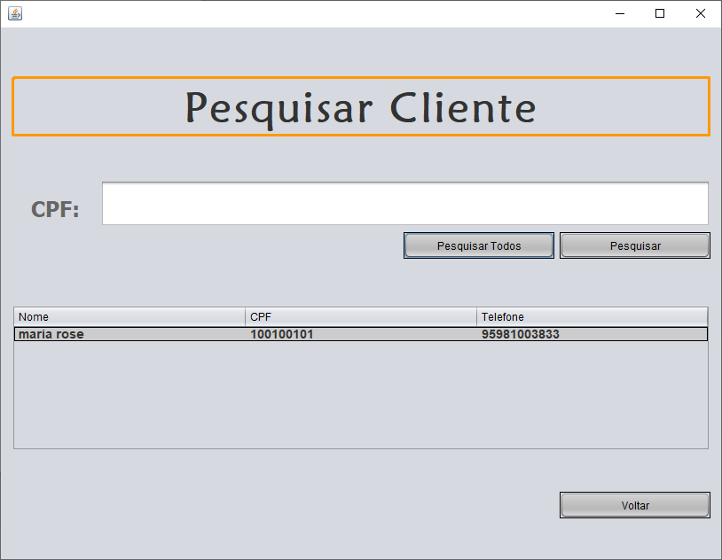

 

Tela de **Atualização** de clientes

 

Tela de **Cadastro** de Funcionários 
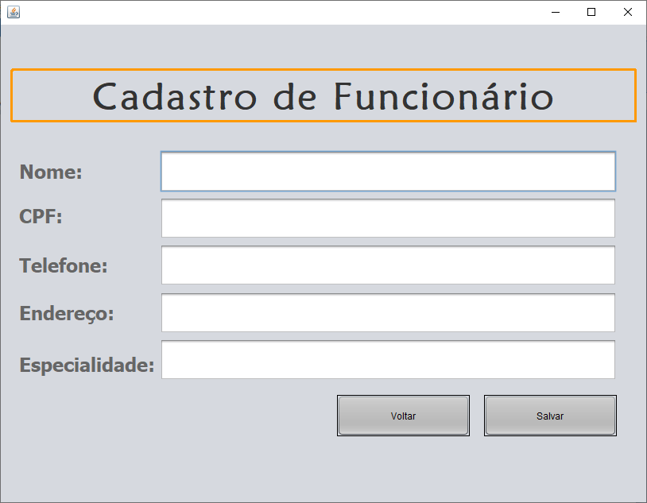

 

Tela de **Remoção** de Funcionários

 

Tela de **Atualização** de Funcionários
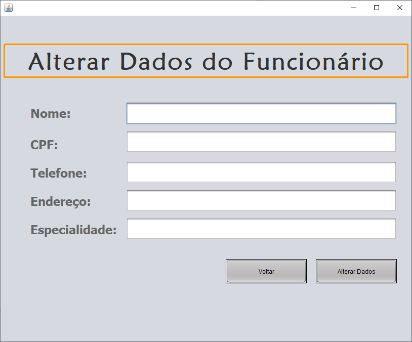

 

Tela de **Listagem** de Funcionários
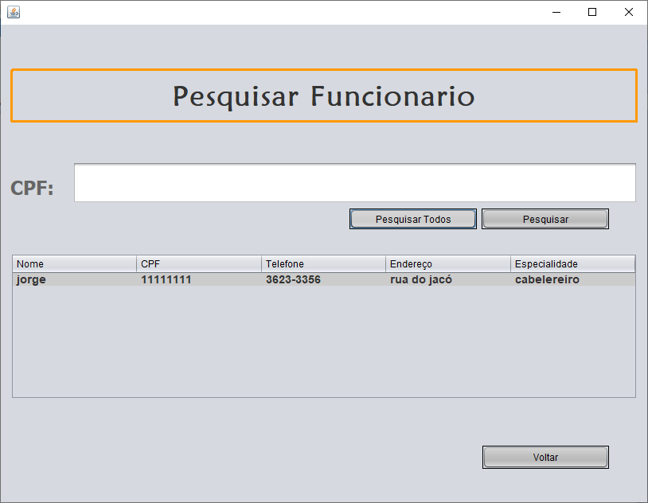

 

Tela de **Agendamento** de horário do cliente com funcionário específico **mostrando o horário do agendamento realizado**
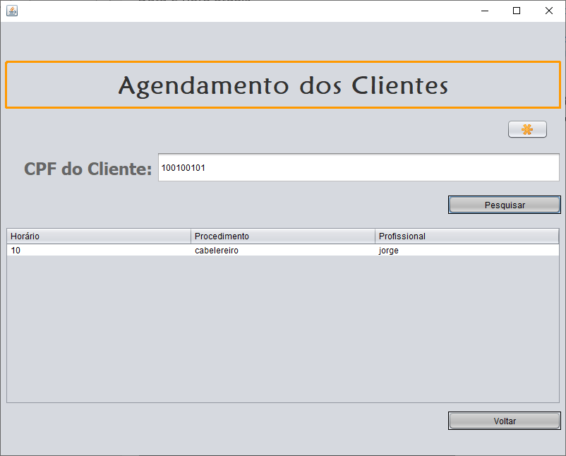

 

Tela para **Agendar o Serviço**
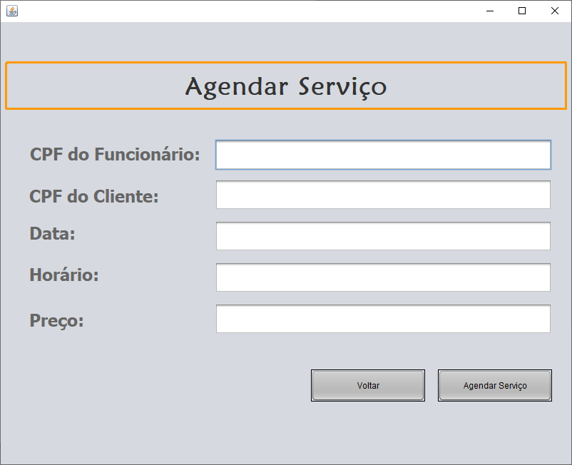

 

Tela para o funcionário **listar quais seus clientes e horários** de serviços que foram agendados 
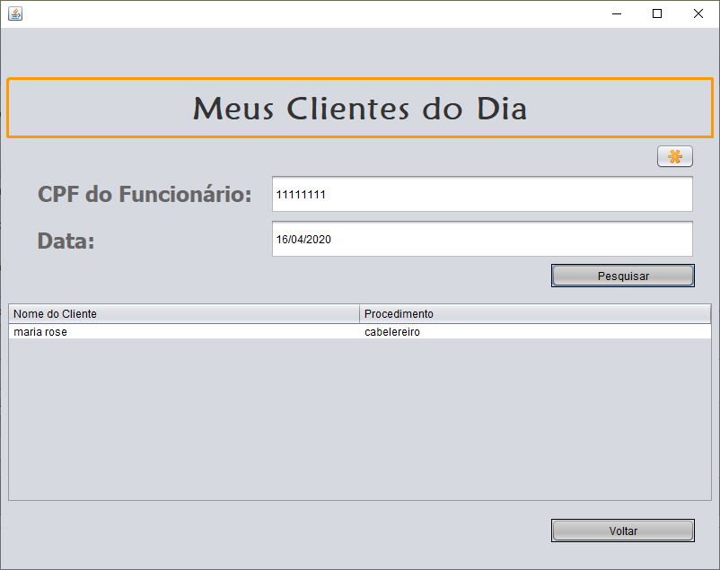

 

Tela mostra **quais horários ainda não foram agendados para tal funcionário** (cada agendamento tem duração de uma hora)
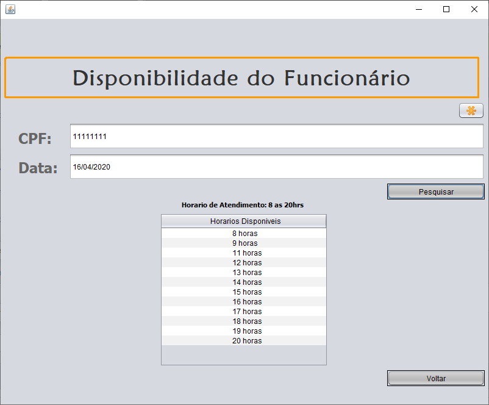

# ESPERO QUE TENHA GOSTADO, OBRIGADO POR CONFERIR.

## E-mail: felipekian@yahoo.com.br
