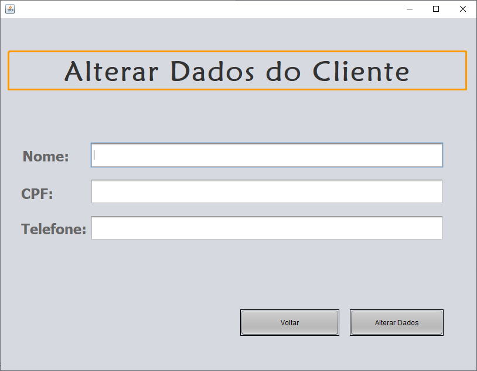

## E-mail: felipekian@yahoo.com.br

# PROJETO SALÃO DE BELEZA

 

## OBJETIVOS

Colocar em **prática os conceitos de POO** ( Programação Orientada à Objetos ) em projeto prático como **Herança, Polimorfismo, Encapsulamento**.

## RECURSOS UTILIZADOS

* **LINGUAGEM JAVA**
* **BANCO DE DADOS MySQL OU MariaDB**

## COMO UTILIZAR ?

* Baixe a pasta **'Sistema - Executável' que conterá o executável do sistema** ( precisa ter o JAVA instalado ).

* Na pasta **'Banco de Dados - SQL - MySQL'** encontra-se o arquivo SQL chamado **'salaoSistema.sql'**. Crie um banco de dados chamado **'salao'** e importe o arquivo para criação das tabelas e relacionamentos. 

# IMAGENS DO SISTEMA

 

 

 

 

 

 

 

 

 

 

 

 

 

 

 

# ESPERO QUE TENHA GOSTADO, OBRIGADO POR CONFERIR.

## E-mail: felipekian@yahoo.com.br
